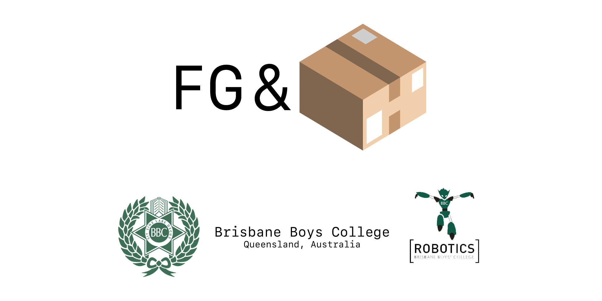

# FG&B 2017

### Welcome to FG&B 2017

## Notable Achievements for 2017

##### Regionals:

##### States:

##### Nationals:

------




------

#####  

#### Documentation written by Thomas Fraser & Alistair English

[FG&B Website](fgb.bbcrobotics.org)

[Brisbane Boys college, Queensland Australia](bbc.qld.edu.au)


------


# Buzzer

#### Contains (.h)

The Buzzer library is used to control an analog buzzer build into FG&B's 2017 robots.

To use the library, import it to your main c++ file

```c++
#include <buzzer.h>
```

To declare the buzzer object

```c++
Buzzer audio = Buzzer();
```

To use the buzzer call the method

```c++
audio.playTone(200);
```


# Compass

#### Contains (.h, .cpp)

The Compass library is use to control the MPU9250 Compass, Gyro and Accelerometer package.

To use the library, import it into your main c++ file

```c++
#include <Compass.h>
```

To declare the compass object

```c++
Compass compass = Compass();
```

To use the compass call these methods

```c++
compass.getUpdate();
double heading = compass.getFinalHeading();
```


# Config

#### Contains (.h)


## Config.h

Config contains configurable constants useful for modifying the behaviour of the robot.

## Defines.h

Defines contains set constants that shouldn't need to be changed

## Pins.h

Pins contains the constant definitions of pins for the teensy micro-controller.

To use these libraries import them using

```c++
#include <Config.h>
#include <Defines.h>
#include <Pins.h>
```


# Direction Controller

#### Contains (.h, .cpp)

The direction controller controls all all directional movement via four motors.

To use the library, import it into your main c++ file

```c++
#include <DirectionController.h>
```

To declare the direction controller object

```c++
DirectionController direction = DirectionController();
```

To use primary methods

```c++
direction.calcMotors(angle, rotation);
//or
direction.calcMotors(angle, rotation, orbitNum);
//or
direction.setPWM(value/*-255 - 255*/);
```


# FGB Common

#### Contains (.h)

The FGB Common header contains methods that are being globally used across multiple libraries and methods that don't belong to a class

To use the library, import it into your main c++ file

```c++
#include <fgbcommon.h>
```


# Kicker

#### Contains (.h)

The Kicker libary controls the actions of the solenoid and lightgate on each robot

To use the library, import it into your main c++ file

```c++
#include <Kicker.h>
```

To call the constructor and declare the kicker object

```c++
Kicker kicker = Kicker();
```

To use the kicker, the lightgate must first be triggered, then the code checks if the delay between kicks it long enough (this is to allow the caps for the solenoid to charge). If both criteria are met, the solenoid will kick.

```c++
kicker.kickerReady();
kicker.checkLightGate();
kicker.kick();
```


# Light

#### Contains (.h, .cpp)

The Light library controls all 20 lightsensors on the botom of the robot and keeps us from going out over the white line.

To use the Light library, import it into your main c++ file

```c++
#include <Kicker.h> //Do I really need to keep doing this for each libaray or do you get the jist?
```

To delcare the Light object

```c++
Light lightsensors = Light();
```

To be completely honest, the other programmer not writing this (Alistair) wrote the lightsensor code and the programmer writing this (Tom) has no damn idea how it works.


# Motor

#### Contains (.h, .cpp)

The motor library controls our 4 Maxon DCX Motors using the LMD18200T motor control chip

To use the Motor ibaray, import it into your main c++ file

```c++
#include <Motor.h>
```

To declare the Motor object

```c++
Motor motorA = Motor(pwm_pin, brk_pin, dir_pin, isRev);
Motor motorB = Motor(pwm_pin, brk_pin, dir_pin, isRev);
Motor motorC = Motor(pwm_pin, brk_pin, dir_pin, isRev);
Motor motorD = Motor(pwm_pin, brk_pin, dir_pin, isRev);
```

To use the motors

```c++
motorA.set(pwm_value);
//or
motorA.brake();
```


# Read TSOPs

#### Contains (.h, .cpp)

The Read TSOPs library reads and controls our TSOP infared sensors

To use the Read TSOPs library, import it into your main c++ file

```c++
#include <ReadTSOPS.h>
```

To declare the TSOP object

```c++
ReadTSOPS tsops;
```

To use the TSOPS

```c++
tsops.read();
//or
tsops.moveTangent();
```


# Rotation Controller

#### Contains (.h, .cpp)

The Rotation Controller library handles all rotational (non directional) movement

To use the Rotation Controller libaray, import it into your main c++ file

```c++
#include <RotationController.h>
```

To declare the Rotation Controller object

```c++
RotationController rotation = RoationController();
```

Unfortunately the Rotation Controller contains code that is very specific to our robots (being the compass MPU9250 and Pixy Camera) so I wont provide any sample use.

------

# Source

If you are reading this, it means I trust you with our source code before its opensourced. If you are going to take any concepts used here, please email us at [18135@bbc.qld.edu.au](18135@bbc.qld.edu.au).


### Buzzer


#### .h

```c++
#ifndef Buzzer_h
#define Buzzer_h

#include <Arduino.h>
#include <Config.h>
#include <Pins.h>
#include <Defines.h>

//
// The Buzzer Class
//
class Buzzer{

public:
    void playTone(int miliS);
    void errorTone();
    void readyTone();
private:

};

// Plays a tone for a amount of time
void Buzzer::playTone(int miliS){
    digitalWrite(BUZZER_PIN, HIGH);
    delay(miliS);
    digitalWrite(BUZZER_PIN, LOW);
}

// Plays a tone to signal an error until the Teensy loses power
void Buzzer::errorTone(){
    digitalWrite(BUZZER_PIN, HIGH);
}

// Plays two tones for 1.5 seconds to signal when the robot is ready to run
void Buzzer::readyTone(){
    playTone(500);
    delay(500);
    playTone(500);
}

#endif
```


### Compass


#### .h

```c++
#ifndef Compass_h
#define Compass_h

#include <Config.h>
#include <Pins.h>
#include <Defines.h>

#include <Wire.h>
#include <Vector3D.h>
#include <math.h>


class Compass {

public:
    Compass();
    double calibrate();
    Vector3D read();
    void update();
    double getHeading();
    void setTarget(double target_);

private:
    long previousTime;
    double calibration;
    double heading;
    double target;

    double doubleMod(double value, double maxVal);

    void I2Cread(uint8_t Address, uint8_t Register, uint8_t Nbytes, uint8_t* Data);
    void I2CwriteByte(uint8_t Address, uint8_t Register, uint8_t Data);

    double convertRawGyro(int16_t raw) {
        // Since we are using 500 degrees/seconds range
        // -500 maps to a raw value of -32768
        // +500 maps to a raw value of 32767

        return (raw * 500.0) / 32768.0;
    }

};

#endif
```

#### .cpp

```c++
#include <Compass.h>

//========Constructor========
Compass::Compass(){
    Wire.begin();
    I2CwriteByte(IMU_ADDRESS, 29, 0x06);
    I2CwriteByte(IMU_ADDRESS, 26, 0x06);
    I2CwriteByte(IMU_ADDRESS, 27, GYRO_FULL_SCALE_500_DPS);
    I2CwriteByte(IMU_ADDRESS, 28, ACC_FULL_SCALE_2_G);
    I2CwriteByte(IMU_ADDRESS, 0x37, 0x02);
    I2CwriteByte(MAG_ADDRESS, 0x0A, 0x16);

    setTarget(0);
}


//========Init Calibrate========
double Compass::calibrate(){
    read();

    delay(COMPASS_CALIBRATION_TIME);

    double reading = 0;
    for(int i=0; i<COMPASS_CALIBRATION_NUMBER; i++){
        reading += (double) read().z;
    }
    calibration = reading/COMPASS_CALIBRATION_NUMBER;

    return calibration;
}

//=====Read / Update======
Vector3D Compass::read(){
    uint8_t buffer[14];
    I2Cread(IMU_ADDRESS, 0x3B, 14, buffer);
    int16_t gx = -(buffer[8] << 8 | buffer[1]);
    int16_t gy = -(buffer[10] << 8 | buffer[11]);
    int16_t gz = buffer[12] << 8 | buffer[13];
    Vector3D returnVector = {convertRawGyro(gx), convertRawGyro(gy), convertRawGyro(gz)};
    return returnVector;
}

void Compass::update() {
    double reading = (double) read().z;

	long currentTime = micros();
    heading += (((double)(currentTime - previousTime) / 1000000.0) * (reading - calibration));
	heading = doubleMod(heading, 360.0);

	previousTime = currentTime;
}

//=======Set Target=======
void Compass::setTarget(double target_){
    target = -target_;
}

//=======Get Heading======
double Compass::getHeading(){
    double curr = (heading - 180) + target;
    return curr;
}


//======Utility Functions======
double Compass::doubleMod(double value, double maxVal){
    return fmod((value + maxVal), maxVal);
}

void Compass::I2Cread(uint8_t Address, uint8_t Register, uint8_t Nbytes, uint8_t* Data)
{

  // Set register address
  Wire.beginTransmission(Address);
  Wire.write(Register);
  Wire.endTransmission();

  // Read Nbytes
  Wire.requestFrom(Address, Nbytes);
  uint8_t index=0;
  while (Wire.available())
    Data[index++]=Wire.read();
}

// Write a byte (Data) in device (Address) at register (Register)
void Compass::I2CwriteByte(uint8_t Address, uint8_t Register, uint8_t Data)
{
  // Set register address
  Wire.beginTransmission(Address);
  Wire.write(Register);
  Wire.write(Data);
  Wire.endTransmission();
}
```


### Config


#### Config.h

```c++
#ifndef Config_h
#define Config_h

//Tsops
#define TSOP_NUM 12
#define READ_THRESHOLD 40
#define TSOP_NUM 12
#define MAX_READS 512
#define TSOP_FORWARD_LOWER 29
#define TSOP_FORWARD_UPPER 331
#define TSOP_ORBIT_ANGLE 90
#define TSOP_MIN_THRESHOLD 30

#define TSOP_K1 12
#define TSOP_K2 2
#define TSOP_K3 1

#define MED_STRENGTH 100
#define HIGH_STRENGTH 150

//Compass
#define COMPASS_CALIBRATION_TIME 2000
#define COMPASS_CALIBRATION_NUMBER 50

//SPI
#define DATA_LENGTH 1

//Lightsensors
#define LIGHTSENSOR_NUM 19
#define LIGHTSENSOR_THRESHOLD 30
#define DETECTED_NUMBER_LIGHT 3

//Pixy

//Kicker
#define KICKER_DELAY 2000L
#define LIGHTGATE_THRESHOLD 100

#endif
```

#### Defines.h

```c++
#ifndef Defines_h
#define Defines_h

//=========IMU (compass) Definitions=========
#define IMU_ADDRESS 0x68
#define MAG_ADDRESS 0x0C

#define GYRO_FULL_SCALE_250_DPS 0x00
#define GYRO_FULL_SCALE_500_DPS 0x08
#define GYRO_FULL_SCALE_1000_DPS 0x10
#define GYRO_FULL_SCALE_2000_DPS 0x18

#define ACC_FULL_SCALE_2_G 0x00
#define ACC_FULL_SCALE_4_G 0x08
#define ACC_FULL_SCALE_8_G 0x10
#define ACC_FULL_SCALE_16_G 0x18

//Pixy
#define PIXY_CENTRE_X 160
#define PIXY_CENTRE_Y 100

//=================Other====================
#define angToRad 0.01745329251
#define radToAng 57.2957795131

//================Lightsensors==============
#define maxNumClusters 20
//CARTESIAN CO-ORDINATES
#define light1x 1.0
#define light1y 0.0

#define light2x 0.9510565162951535
#define light2y 0.3090169943749474

#define light3x 0.8090169943749475
#define light3y 0.5877852522924731

#define light4x 0.587785252292473
#define light4y 0.8090169943749475

#define light5x 0.30901699437494745
#define light5y 0.9510565162951535

#define light6x -0.30901699437494756
#define light6y 0.9510565162951535

#define light7x -0.587785252292473
#define light7y 0.8090169943749475

#define light8x -0.8090169943749473
#define light8y 0.5877852522924732

#define light9x -0.9510565162951535
#define light9y 0.3090169943749475

#define light10x -1.0
#define light10y 0.0

#define light11x -0.9510565162951536
#define light11y -0.3090169943749473

#define light12x -0.8090169943749472
#define light12y -0.5877852522924734

#define light13x -0.5877852522924732
#define light13y -0.8090169943749473

#define light14x -0.30901699437494756
#define light14y -0.9510565162951535

#define light15x 0.0
#define light15y -1.0

#define light16x 0.30901699437494723
#define light16y -0.9510565162951536

#define light17x 0.5877852522924737
#define light17y -0.809016994374947

#define light18x 0.8090169943749473
#define light18y -0.5877852522924734

#define light19x 0.9510565162951535
#define light19y -0.3090169943749476

#endif
```

#### Pins.h

```c++
#ifndef Pins_h
#define Pins_h

//========Tsop Pins========
#define POWER_PIN_1 0
#define POWER_PIN_2 20

//========Light Pins=======
//NOTE: SENSOR 1 IS THE RIGHT HAND ONE AND THEN THEY GO ANTICLOCKWISE AROUND THE CIRCLE
//(excluding the top most one - ask Al if ur unsure)
#define LIGHT_1 A4
#define LIGHT_2 A3
#define LIGHT_3 A2
#define LIGHT_4 A1
#define LIGHT_5 A0
#define LIGHT_6 A18
#define LIGHT_7 A17
#define LIGHT_8 A16
#define LIGHT_9 A15
#define LIGHT_10 A14
#define LIGHT_11 A13
#define LIGHT_12 A12
#define LIGHT_13 A11
#define LIGHT_14 A10
#define LIGHT_15 A9
#define LIGHT_16 A8
#define LIGHT_17 A7
#define LIGHT_18 A6
#define LIGHT_19 A5

//============Kicker pins==========
#define LIGHTGATE_PIN 0
#define KICKER_PIN 0

//============Buzzer pins==========
#define BUZZER_PIN 0

//Motor Pins
#define MOTOR_A_PWM 3
#define MOTOR_B_PWM 4
#define MOTOR_C_PWM 5
#define MOTOR_D_PWM 21
//
#define MOTOR_A_DIR 6
#define MOTOR_B_DIR 7
#define MOTOR_C_DIR 8
#define MOTOR_D_DIR 22
//
#define MOTOR_A_BRK 0
#define MOTOR_B_BRK 1
#define MOTOR_C_BRK 2
#define MOTOR_D_BRK 20
//
#define MOTOR_A_REV 1
#define MOTOR_B_REV 0
#define MOTOR_C_REV 1
#define MOTOR_D_REV 0

//============LED Indicators==========
#define LED_IND_1 28
#define LED_IND_2 27
#define LED_IND_3 26
#define LED_IND_4 25

#endif
```


### Direction Controller


#### .h

```c++
#ifndef DirectionController_h
#define DirectionController_h

#include <Config.h>
#include <Pins.h>
#include <Defines.h>
#include <Arduino.h>
#include <Motor.h>
// #include <Light.h>
#include <ReadTSOPS.h>
#include <RotationController.h>

struct lightStruct {
    bool seeing;
    double angle;
};

class DirectionController{

public:
    DirectionController();

    //Calculate motor angles
    void calcMotors(double angle, double rotation);

    //Calculate motor angles
    void calcMotors(double angle, double rotation, int dirNum);

    //Calculate lightsensors
    lightStruct calcLight();

    //Combines lightsensors and tsop direction
    void move(double angle);

    void setPWM(int pwm);

    Motor motorD = Motor(MOTOR_A_PWM, MOTOR_A_DIR, MOTOR_A_BRK, MOTOR_A_REV); //Really Motor D
    Motor motorA = Motor(MOTOR_B_PWM, MOTOR_B_DIR, MOTOR_B_BRK, MOTOR_B_REV); //Really Motor A
    Motor motorB = Motor(MOTOR_C_PWM, MOTOR_C_DIR, MOTOR_C_BRK, MOTOR_C_REV);
    Motor motorC = Motor(MOTOR_D_PWM, MOTOR_D_DIR, MOTOR_D_BRK, MOTOR_D_REV);

private:
    int angleArray[4] = {60, 135, 225, 300};

    double direction;

    // Light light = Light();

    double lightAngle;
    lightStruct values;

    // RotationController rotationController = RotationController();
};


#endif
```

#### .cpp

```c++
#include <DirectionController.h>

DirectionController::DirectionController(){
    // light.init();
}

void DirectionController::calcMotors(double angle, double rotation){
    //Solve the whole going forward while no seeing ball thing
    if(angle != 65506.00){
        motorA.set((cos(((angleArray[0] + 90) * angToRad) - (angle * angToRad))) * 100); //Probs should do this motor stuff in the main application? I guess we can do it here tho. Might be less clear to observers
        motorB.set((cos(((angleArray[1] + 90) * angToRad) - (angle * angToRad))) * 100);
        motorC.set((cos(((angleArray[2] + 90) * angToRad) - (angle * angToRad))) * 100);
        motorD.set((cos(((angleArray[3] + 90) * angToRad) - (angle * angToRad))) * 100);
    }else{
        motorA.set(0);
        motorB.set(0);
        motorC.set(0);
        motorD.set(0);
    }
}

void DirectionController::calcMotors(double angle, double rotation, int dirNum){
    int newAngle = (abs(round(angle/(360*1/dirNum))))*(360*1/dirNum);

    if(newAngle != -1){
        direction = newAngle < 180 ? (newAngle + 90) : (newAngle - 90);
    }

    motorA.set(((cos(((angleArray[0] + 90) * angToRad) - (direction * angToRad))) * 255) + rotation);
    motorB.set(((cos(((angleArray[1] + 90) * angToRad) - (direction * angToRad))) * 255) + rotation);
    motorC.set(((cos(((angleArray[2] + 90) * angToRad) - (direction * angToRad))) * 255) + rotation);
    motorD.set(((cos(((angleArray[3] + 90) * angToRad) - (direction * angToRad))) * 255) + rotation);
}

lightStruct DirectionController::calcLight(){
    values = {false, 0};
    //light.readLight();
    //light.averageAngles();
    //lightAngle = light.getAngle();
    if(lightAngle >= 0){
        values = {true, lightAngle};
        return values;
    }
    else{
        return values;
    }
}

void DirectionController::move(double tsopAngle){
    if(calcLight().seeing == false){
        calcMotors(tsopAngle, /*rotationController.rotate()*/0.00);
    }
    else{
        calcMotors(calcLight().angle/*Takes in angle to move away from line as oppose to following ball*/, /*rotationController.rotate()*/0.00);
    }
}

void DirectionController::setPWM(int pwm){
    motorA.set(pwm);
    motorB.set(pwm);
    motorC.set(pwm);
    motorD.set(pwm);
}
```


### FGB Common


#### .h

```c++
#include <Arduino.h>

#ifndef fgbcommon_h
#define fgbcommon_h

#define SHIFTARRAY(arr, input){                                 \
    for(int q = sizeof(arr)/sizeof(arr[0]) - 1; q >= 0; q--){   \
        *(arr + q + 1) = *(arr + q);                            \
    }                                                           \
    *(arr + 0) = input;                                         \
}                                                               \


#endif
```


### Kicker


#### .h

```c++
#ifndef Kicker_h
#define Kicker_h

#include <Arduino.h>
#include <Config.h>
#include <Pins.h>

enum kickerStatus {
    unknown,
    notReady,
    waitingForLightGate,
    waitingForCharge,
    ready
};

class Kicker{
public:
    Kicker();
    //Check if the kicker is ready to kick
    void kickerReady();
    //Check if the light gate is seeing the ball
    void checkLightGate();
    //Kick the ball
    void kickBall();
private:
    kickerStatus status;
    long currentMSec, lastKick;

};

#endif
```

#### .cpp

```c++
#include <Kicker.h>

Kicker::Kicker(){
    pinMode(KICKER_PIN, OUTPUT);
    digitalWrite(KICKER_PIN, LOW);
    pinMode(LIGHTGATE_PIN, INPUT);
    status = kickerStatus::unknown;
}

void Kicker::kickerReady(){
    long currentMSec = micros();
    if((currentMSec - lastKick) >= KICKER_DELAY){
        status = kickerStatus::waitingForLightGate;
    }
    else{
        status = kickerStatus::waitingForCharge;
    }
}

void Kicker::checkLightGate(){
    if(analogRead(LIGHTGATE_PIN) <= LIGHTGATE_THRESHOLD && status == kickerStatus::waitingForLightGate){
        status = kickerStatus::ready;
    }
}

void Kicker::kickBall(){
    if(status == kickerStatus::ready){
        digitalWrite(KICKER_PIN, HIGH);
        delay(50); //To Change in the future to a loop system. This will slow the robot down.
        digitalWrite(KICKER_PIN, LOW);
        lastKick = micros();
        status = kickerStatus::notReady;
    }
    else{
        status = kickerStatus::notReady;
    }
}
```


### Light

#### .h

```c++

```

#### .cpp

```c++

```


### Motor


#### .h

```c++
#ifndef Motor_h
#define Motor_h

// #include <Config.h>
// #include <Pins.h>
// #include <Defines.h>
#include <Arduino.h>

class Motor{

public:
    Motor(int pwm, int dir, int brk, int rev);

    //Set a pwm value to the motor
    void set(int pwm);
    //Stop the motor with no coast
    void brake();

private:
    int r_brk;
    int r_pwm;
    int r_dir;
    int reversed;
};

#endif
```

#### .cpp

```c++
#include <Motor.h>

Motor::Motor(int pwm, int dir, int brk, int rev){
    pinMode(pwm, OUTPUT);
    pinMode(dir, OUTPUT);
    pinMode(brk, OUTPUT);
    reversed = rev;
    r_pwm = pwm;
    r_dir = dir;
    r_brk = brk;
    analogWriteFrequency(pwm, 19000);
}
void Motor::set(int pwm){
    digitalWrite(r_dir, pwm > 0 ? !reversed : reversed);
    analogWrite(r_pwm, pwm > 0 ? pwm : -pwm);
    digitalWrite(r_brk, LOW);
}
void Motor::brake(){
    digitalWrite(r_dir, LOW);
    analogWrite(r_pwm, 0);
    digitalWrite(r_brk, HIGH);
}
```


### Read TSOPs


#### .h

```c++
#ifndef ReadTSOPS_h
#define ReadTSOPS_h

#include <Config.h>
#include <Pins.h>
#include <Defines.h>
#include <Arduino.h>
#include <math.h>

class ReadTSOPS{

public:
    ReadTSOPS();

    //Read the Tsops
    void read();

    //Reset the Tsops by dropping power
    void reset();

    //Stop reading tsops, error has occured
    void stop();

    //Calculate a tangent to move on to orbit around the ball
    int moveTangent();

    //Find the strength for the ball and determine how to orbit
    double findStrength();

    int bestSensor;
    double angleToBall;

private:
    int sensors[12] = {1,2,3,4,5,6,7,8,9,15,16,17};
    int values[12];
    int index;
    int value_index;
    int mod(int x, int m);
    double correctOrbit(double angleIn);

};

#endif
```

#### .cpp

```c++
#include <ReadTSOPS.h>
#include <Arduino.h>
// #define TSOP_NUM 12
// #define MAX_READS 128
//
// #define POWER_PIN_1 0
// #define POWER_PIN_2 0
// #define READ_THRESHOLD 40

ReadTSOPS::ReadTSOPS(){
    for(int i = 0; i < TSOP_NUM; i++){
        pinMode(sensors[i], INPUT);
    }
    pinMode(POWER_PIN_1, OUTPUT);
    pinMode(POWER_PIN_2, OUTPUT);

    bestSensor = 0;
    index = 0;
}

void ReadTSOPS::read(){
    bestSensor = 0;
    value_index = 0;
    index = -1;
    digitalWrite(POWER_PIN_1, HIGH);
    digitalWrite(POWER_PIN_2, HIGH);
    for(int j = 0; j < MAX_READS; j++){
        for(int i = 0; i < TSOP_NUM; i++){
            values[i] += (digitalRead(sensors[i]) == HIGH ? 0 : 1);
        }
    }
    digitalWrite(POWER_PIN_1, LOW);
    digitalWrite(POWER_PIN_2, LOW);
    delayMicroseconds(3000); //We can remove this if we dont need it later.
    for(int i = 0; i < TSOP_NUM; i++){
        // Filtering
        if(values[i] < TSOP_MIN_THRESHOLD){
            values[i] = 0;
        }
        if(values[i] > value_index){
            index = i; //1-12 as oppose to 0-11
            value_index = values[i];
        }
        values[i] = 0;
    }
    bestSensor = index;
}

void ReadTSOPS::reset(){
    digitalWrite(POWER_PIN_1, LOW);
    digitalWrite(POWER_PIN_2, LOW);
    delay(2);
    digitalWrite(POWER_PIN_1, HIGH);
    digitalWrite(POWER_PIN_2, HIGH);
}

void ReadTSOPS::stop(){
    digitalWrite(POWER_PIN_1, LOW);
    digitalWrite(POWER_PIN_2, LOW);
}

int ReadTSOPS::moveTangent(){ //Hmmmmm This shouldnt be done here, it should be done later down the course.
    read();
    //Begin weighting
    angleToBall = index * 30.00;

    return (int)correctOrbit(angleToBall);
    return (int)angleToBall;

    // if(angleToBall < 180.00 && angleToBall != 0){
    //     return angleToBall + 90.00;
    // }
    // if(angleToBall > 180.00 && angleToBall != 0){
    //     return angleToBall - 90.00;
    // }
    // return 0;
}

double ReadTSOPS::findStrength(){
     bestSensor = 0;
    value_index = 0;
    index = 0;
    for(int i = 0; i < TSOP_NUM; i++){
        values[i] = 0;
    }
    digitalWrite(POWER_PIN_1, HIGH);
    digitalWrite(POWER_PIN_2, HIGH);
    for(int j = 0; j < MAX_READS; j++){
        for(int i = 0; i < TSOP_NUM; i++){
            values[i] += (digitalRead(sensors[i]) == HIGH ? 0 : 1);
        }
    }
    digitalWrite(POWER_PIN_1, LOW);
    digitalWrite(POWER_PIN_2, LOW);
    delayMicroseconds(3000); //We can remove this if we dont need it later.
    for(int i = 0; i < TSOP_NUM; i++){
        // Filtering
        if(values[i] < 30){
            values[i] = 0;
        }
        if(values[i] > value_index){
            index = i + 1; //1-12 as oppose to 0-11
            value_index = values[i];
        }
        // values[i] = 0;
    }
    bestSensor = index;
    double tempStr = TSOP_K1 * values[bestSensor] + TSOP_K2 * (values[mod(bestSensor-1, TSOP_NUM)] + values[mod(bestSensor+1, TSOP_NUM)]) + TSOP_K3 * (values[mod(bestSensor-2, TSOP_NUM)] + values[mod(bestSensor+2, TSOP_NUM)]);
    return tempStr/16;
}

int ReadTSOPS::mod(int x,int m){
    int r = x % m;
    return r < 0 ? r + m : r;
}

double ReadTSOPS::correctOrbit(double angleIn){
    if(angleIn <= TSOP_FORWARD_LOWER || angleIn >= TSOP_FORWARD_UPPER){
        return angleIn;
    }else{
        return angleIn < 180 ? (angleIn + TSOP_ORBIT_ANGLE) : (angleIn - TSOP_ORBIT_ANGLE);
    }
}
```


### Rotation Controller


#### .h

```c++
#ifndef RotationController_h
#define RotationController_h

#include <Config.h>
#include <Pins.h>
#include <Defines.h>
#include <Arduino.h>
#include <PixyI2C.h>
#include <Compass.h>

class RotationController{

public:
    RotationController(){};

    //Gets the pixy information
    bool getPixy();

    //Calulates the pixy and which direction to go
    void calcPixy();

    //Calculates the rotation needed to face the centre of the goal
    void calcRotation();

    //Uses compass library to find the compass roataion required
    void getCompass();

    //The final rotation to add to the motors
    double rotate();

private:
    PixyI2C pixy;
    Compass compass = Compass();
    int rotationToAdd;
    int finalRotation;

    int blockHeight, blockWidth, blockX, blockY;

    double compassHeading;
    double newTarget;

};

#endif
```

#### .cpp

```c++
#include <RotationController.h>

bool RotationController::getPixy(){
    if(pixy.getBlocks()){ //seing the block
        blockHeight = pixy.blocks[0].height;
        blockWidth = pixy.blocks[0].width;
        blockX = pixy.blocks[0].x;
        blockY = pixy.blocks[0].y;
        return true;
    }
    return false;
}

void RotationController::getCompass(){
    compass.update();
    compassHeading = compass.getHeading();
}


void RotationController::calcPixy(){
    if(getPixy()){
        if(blockX >= PIXY_CENTRE_X){
            rotationToAdd = blockX - PIXY_CENTRE_X;
        }
        else if(blockX <= PIXY_CENTRE_X){
            rotationToAdd = PIXY_CENTRE_X - blockX;
        }
    }
    else{
        rotationToAdd = 0;
    }
}

void RotationController::calcRotation(){
    newTarget = compassHeading > 180 ? compassHeading - rotationToAdd : compassHeading + rotationToAdd;
    compass.setTarget(newTarget);
}

double RotationController::rotate(){
    compass.update();
    finalRotation = compass.getHeading();
}
```


---


